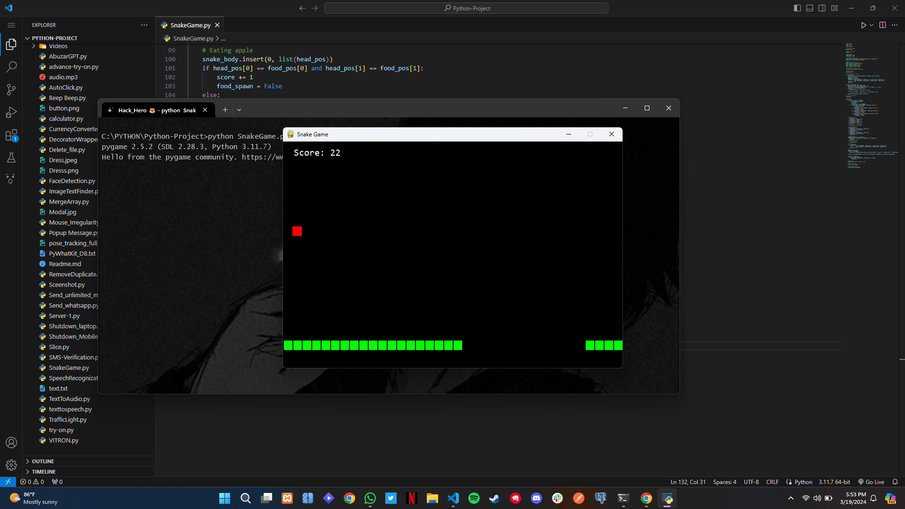

# Snake-Game-Using-Python

The Snake Game is a classic arcade game where you control a snake 🟩 that grows longer by eating food 🍎 while avoiding collisions with itself and the walls 🧱 of the game board. Enjoy the challenge of increasing your score 🏆 and mastering the art of maneuvering the snake through the maze-like arena! 🎮

## Features

- Player-controlled snake movement using arrow keys or WASD keys.
- Random spawning of food pellets on the game board.
- Increasing snake length and score upon eating food.
- Game over condition when the snake collides with itself or the game board boundaries.
- Score display on the game screen.
- Adjustable game speed for varying levels of difficulty.

## Dependencies

- Python 3.x
- Pygame library

## Usage

1. Make sure you have Python installed on your system.
2. Install the Pygame library using `pip install pygame`.
3. Clone or download the project files from this repository.
4. Run the `snake_game.py` file using Python.

## Controls

- Use the arrow keys (Up, Down, Left, Right) or the WASD keys (W, A, S, D) to control the snake's movement.
- Press the Esc key or close the game window to exit the game.

## Contributing

Contributions are welcome! If you find any bugs or have suggestions for improvements, please open an issue or submit a pull request.

## License

This project is licensed under the MIT License. See the `LICENSE` file for details.
